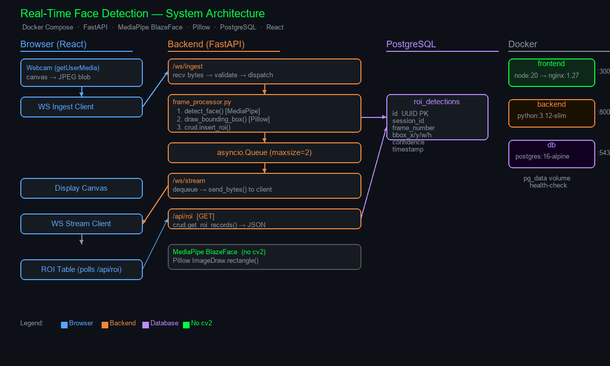

# FaceStream — Real-Time Face Detection Video Streaming System

A containerised full-stack application that captures webcam video in the browser, detects faces in real time using MediaPipe BlazeFace, draws bounding boxes with Pillow, persists detection data in PostgreSQL, and streams the annotated feed back to the browser — all without OpenCV.



---

## Table of Contents

1. [Features](#features)
2. [Tech Stack](#tech-stack)
3. [Architecture Overview](#architecture-overview)
4. [Project Structure](#project-structure)
5. [Quick Start (Production)](#quick-start-production)
6. [Development Mode (HMR)](#development-mode-hmr)
7. [Environment Variables](#environment-variables)
8. [API Reference](#api-reference)
9. [Database Schema](#database-schema)
10. [Running Tests](#running-tests)
11. [Design Decisions](#design-decisions)
12. [Security Notes](#security-notes)
13. [Troubleshooting](#troubleshooting)

---

## Features

- **Live webcam capture** — `getUserMedia` at 15 fps, encoded as JPEG in the browser
- **Real-time face detection** — MediaPipe BlazeFace, 3–8 ms/frame on CPU
- **Annotated stream** — bounding boxes drawn server-side with Pillow, streamed back as JPEG
- **Persistent detection log** — every detected face stored in PostgreSQL with bbox, confidence, and timestamp
- **REST API** — paginated `/api/roi` endpoint with frame-range filters
- **Light / Dark / System theme** — three-way toggle persisted to localStorage, no flash on load
- **No OpenCV** — zero `cv2` imports in application code

---

## Tech Stack

| Layer | Technology |
|---|---|
| Frontend | React 18 + TypeScript + Vite → nginx |
| Styling | CSS custom properties, Inter font |
| Backend | Python 3.12, FastAPI, uvicorn |
| Face Detection | MediaPipe BlazeFace (no OpenCV) |
| Bounding Box Drawing | Pillow `ImageDraw.rectangle()` |
| Frame Transport | WebSocket binary (two sockets: ingest + stream) |
| Database | PostgreSQL 16, SQLAlchemy 2.0 async, Alembic |
| Containerisation | Docker Compose (production + dev override) |
| Testing | pytest-asyncio, httpx-ws, SQLite in-memory |

---

## Architecture Overview

```
Browser                        Backend (FastAPI)               PostgreSQL
  │                                   │                              │
  │  getUserMedia → canvas → JPEG      │                              │
  │  WS /ws/ingest ──────────────────► │                              │
  │                                   │  PIL.open → np.array         │
  │                                   │  mediapipe detect            │
  │                                   │  Pillow draw bbox            │
  │                                   │  queue.put_nowait(frame)     │
  │                                   │  crud.insert_roi() ─────────►│
  │                                   │  ws.send_text(ack)           │
  │  ◄── WS /ws/stream (binary) ───── │  stream router dequeues      │
  │  draw to canvas                   │                              │
  │  GET /api/roi every 2 s ──────────────────────────────────────── │ SELECT
```

**Two WebSocket connections per session:**
- `/ws/ingest` — browser → server (raw frames)
- `/ws/stream` — server → browser (annotated frames)

An `asyncio.Queue(maxsize=2)` bridges ingest to stream. When the queue is full the oldest frame is dropped, keeping latency minimal under load.

---

## Project Structure

```
MegaAIAssessment/
├── docker-compose.yml          # Production stack
├── docker-compose.dev.yml      # Dev override — Vite HMR instead of nginx
├── .env.example                # Copy to .env before first run
├── .gitignore
├── README.md
│
├── backend/
│   ├── Dockerfile
│   ├── requirements.txt        # All versions pinned
│   ├── alembic.ini
│   ├── alembic/
│   │   ├── env.py
│   │   └── versions/
│   │       └── 0001_initial.py
│   └── app/
│       ├── main.py             # FastAPI app factory + lifespan
│       ├── config.py           # pydantic-settings (reads .env)
│       ├── database.py         # Async engine + session factory
│       ├── models.py           # RoiDetection ORM model
│       ├── schemas.py          # Pydantic I/O schemas
│       ├── crud.py             # insert_roi, get_roi_records
│       ├── utils.py            # UUID validation helper
│       ├── detection/
│       │   ├── detector.py     # MediaPipe singleton, detect_face()
│       │   └── drawing.py      # Pillow draw_bounding_box()
│       ├── routers/
│       │   ├── ingest.py       # WS /ws/ingest
│       │   ├── stream.py       # WS /ws/stream
│       │   └── roi.py          # GET /api/roi
│       └── services/
│           └── frame_processor.py  # detect → draw → store → queue
│
├── backend/tests/
│   ├── conftest.py             # SQLite fixtures, ws_app fixture
│   ├── test_detection.py       # Unit tests: detector + drawing
│   ├── test_crud.py            # Unit tests: DB helpers
│   ├── test_ws_ingest.py       # Integration: /ws/ingest
│   ├── test_ws_stream.py       # Integration: /ws/stream
│   └── test_roi_api.py         # Integration: GET /api/roi
│
├── frontend/
│   ├── Dockerfile              # Multi-stage: node build → nginx serve
│   ├── nginx.conf
│   ├── vite.config.ts          # Proxy /ws and /api to backend
│   ├── package.json
│   ├── tsconfig.json
│   ├── index.html              # Anti-FOUC theme script
│   └── src/
│       ├── main.tsx
│       ├── styles.css          # Design system — light + dark CSS variables
│       ├── App.tsx             # Root layout
│       ├── hooks/
│       │   ├── useWebcamCapture.ts  # getUserMedia → canvas → WS send
│       │   ├── useVideoStream.ts    # WS recv → canvas draw
│       │   └── useTheme.ts          # light / dark / system preference
│       ├── components/
│       │   ├── VideoDisplay.tsx     # Canvas + idle overlay + LIVE badge
│       │   ├── ConfidenceRing.tsx   # SVG 3/4-arc gauge
│       │   ├── DetectionLog.tsx     # Card list with inline confidence bars
│       │   ├── ThemeToggle.tsx      # Segmented pill (☀ / ⬜ / ☽)
│       │   └── InfoTooltip.tsx      # Hover tooltip (CSS-driven, persistent)
│       └── api/
│           └── roiClient.ts         # fetchRoi() REST helper
│
├── db/
│   └── init.sql                # pgcrypto + table + indexes
│
└── architecture/
    └── system_diagram.png
```

---

## Quick Start (Production)

**Prerequisites:** Docker Desktop (Compose v2), Git, a browser with camera access

```bash
git clone <repo-url>
cd MegaAIAssessment

cp .env.example .env        # defaults work out of the box

docker compose up --build
```

First build takes ~4–5 minutes (downloads Python 3.12, MediaPipe ~200 MB, Node.js).

| Service | URL |
|---|---|
| Frontend | http://localhost:3000 |
| Backend API docs | http://localhost:8000/docs |
| PostgreSQL | localhost:5432 (credentials in `.env`) |

Click **Start**, allow camera access, and face detection begins immediately.

---

## Development Mode (HMR)

For frontend development, a Compose override replaces the nginx container with Vite's dev server. Every save to `frontend/src/**` hot-reloads in the browser instantly — no rebuild needed.

```bash
# Stop the production stack first if running
docker compose down

# Start with HMR override
docker compose -f docker-compose.yml -f docker-compose.dev.yml up
```

| Service | URL |
|---|---|
| Frontend (Vite HMR) | http://localhost:3001 |
| Backend API | http://localhost:8000 |

The first run installs `node_modules` inside the container (~30 s). Wait for the `VITE ready` line before opening the browser.

To go back to the production build:

```bash
docker compose up --build
```

---

## Environment Variables

Copy `.env.example` to `.env`. All variables have working defaults for local development.

| Variable | Default | Description |
|---|---|---|
| `POSTGRES_USER` | `facestream` | PostgreSQL username |
| `POSTGRES_PASSWORD` | `facestream` | PostgreSQL password |
| `POSTGRES_DB` | `facestream` | Database name |
| `DATABASE_URL` | _(set by compose)_ | Full async connection string |
| `BACKEND_CORS_ORIGINS` | `http://localhost:3000` | Comma-separated allowed origins |

> Secrets are gitignored. Never commit a populated `.env`.

---

## API Reference

### `WS /ws/ingest?session_id={uuid}`

Receives raw JPEG frames (binary) from the client.

- **Client → Server:** binary JPEG bytes (max 2 MB; close code 4001 if exceeded)
- **Server → Client:** JSON ack per frame

```json
{ "frame": 42, "detected": true, "confidence": 0.9731 }
```

- Missing or invalid `session_id` → close code 4000
- Ingest timeout (30 s with no frame) → close code 1001

---

### `WS /ws/stream?session_id={uuid}`

Streams annotated JPEG frames back to the client.

- **Server → Client:** binary annotated JPEG
- On session end: `{"event": "session_ended"}` then close

Frames are sourced from an `asyncio.Queue(maxsize=2)` shared with the ingest socket. If the queue is full, the oldest frame is dropped to keep latency low.

---

### `GET /api/roi`

Returns paginated face detection records for a session.

| Query Param | Type | Default | Description |
|---|---|---|---|
| `session_id` | UUID | **required** | Session identifier |
| `limit` | int | 50 | Records per page (max 200) |
| `offset` | int | 0 | Pagination offset |
| `from_frame` | int | — | Start frame (inclusive) |
| `to_frame` | int | — | End frame (inclusive) |

**200 Response:**

```json
{
  "session_id": "f1f1f1f1-f1f1-f1f1-f1f1-f1f1f1f1f1f1",
  "total": 142,
  "has_next": true,
  "items": [
    {
      "id": "uuid",
      "frame_number": 47,
      "timestamp": "2026-05-05T14:23:01.123Z",
      "bbox": { "x": 210.5, "y": 88.0, "width": 134.2, "height": 148.7 },
      "confidence": 0.9873,
      "frame_width": 640,
      "frame_height": 480
    }
  ]
}
```

**Error codes:** 400 missing session_id · 422 validation error · 500 DB unavailable

---

## Database Schema

```sql
CREATE TABLE roi_detections (
    id            UUID         PRIMARY KEY DEFAULT gen_random_uuid(),
    session_id    VARCHAR(64)  NOT NULL,
    frame_number  INTEGER      NOT NULL CHECK (frame_number >= 0),
    timestamp     TIMESTAMPTZ  NOT NULL DEFAULT NOW(),
    bbox_x        FLOAT        NOT NULL,
    bbox_y        FLOAT        NOT NULL,
    bbox_width    FLOAT        NOT NULL,
    bbox_height   FLOAT        NOT NULL,
    confidence    FLOAT        NOT NULL CHECK (confidence BETWEEN 0 AND 1),
    frame_width   INTEGER      NOT NULL,
    frame_height  INTEGER      NOT NULL
);

CREATE INDEX idx_roi_session_ts ON roi_detections (session_id, timestamp DESC);
CREATE INDEX idx_roi_frame      ON roi_detections (session_id, frame_number);
```

Bounding box values are stored as absolute pixels. `frame_width` / `frame_height` are stored alongside to allow normalisation if needed. UUID primary key avoids leaking row count.

Alembic migrations run automatically on every backend startup (`alembic upgrade head`).

---

## Running Tests

```bash
# Inside Docker (recommended — no local Python needed)
docker compose exec backend pytest tests/ -v

# Locally (requires Python 3.12)
cd backend
pip install -r requirements.txt
pytest tests/ -v
```

Tests use an **in-memory SQLite database** — no Postgres instance required. WebSocket tests use `httpx-ws` with `ASGIWebSocketTransport` and a custom `ws_app` fixture that seeds `app.state` manually (since the ASGI transport does not run the FastAPI lifespan).

**Test coverage:**

| File | What it tests |
|---|---|
| `test_detection.py` | `detect_face()` on real JPEG fixtures; `draw_bounding_box()` output |
| `test_crud.py` | `insert_roi()`, `get_roi_records()` pagination and frame-range filters |
| `test_ws_ingest.py` | Valid JPEG ack, frame counter increment, invalid bytes, missing session_id |
| `test_ws_stream.py` | Frame delivery after ingest, `session_ended` event on disconnect |
| `test_roi_api.py` | Empty session, insert-then-GET, missing session_id 400, limit capping |

---

## Design Decisions

### No OpenCV — MediaPipe + Pillow instead

The constraint prohibits `cv2`. MediaPipe's `face_detection` solution runs BlazeFace internally and accepts NumPy arrays in RGB format directly from Pillow — no OpenCV at any point. Pillow `ImageDraw.rectangle()` handles bounding box rendering in a single call.

### Two WebSocket connections per session

Separating `/ws/ingest` (browser → server) and `/ws/stream` (server → browser) lets each side reconnect independently without interrupting the other. It also keeps the ingest path synchronous with the frame pipeline — the browser always gets an ack before sending the next frame.

### asyncio.Queue backpressure

The queue bridge between ingest and stream has `maxsize=2`. When the stream consumer is slow, `put_nowait` raises `QueueFull` and the backend simply drops the frame rather than accumulating memory. This keeps perceived latency constant under load.

### Thread pool for MediaPipe

MediaPipe is CPU-bound and not async-aware. Inference runs in a `ThreadPoolExecutor` via `loop.run_in_executor()` so the event loop is never blocked. Thread-local `FaceDetection` instances avoid MediaPipe's internal state being shared across threads.

### SQLAlchemy async sessions

Every detected face is written to Postgres inside the same request cycle. Async sessions keep these writes off the event loop thread so they don't delay the ack or the next frame being enqueued.

### Alembic over raw SQL for migrations

`alembic upgrade head` runs automatically at container startup. This means schema changes are applied on redeploy with no manual intervention, and the migration history is version-controlled alongside the code.

---

## Security Notes

| Control | Implementation |
|---|---|
| Frame size limit | Frames > 2 MB close the WebSocket with code 4001 |
| Session ID validation | UUID v4 regex checked before any DB query or queue access |
| CORS | Explicit origin allowlist via `BACKEND_CORS_ORIGINS` — no wildcard |
| SQL injection | All queries via SQLAlchemy ORM — no raw SQL with user input |
| Secrets | `.env` gitignored; `.env.example` committed with placeholders only |
| Package pinning | All versions pinned in `requirements.txt` and `package.json` |

---

## Troubleshooting

| Symptom | Likely cause | Fix |
|---|---|---|
| Port already allocated on startup | Stale Docker port reservation | `docker compose down` then `docker compose up` again; or `docker rm <container-id>` for the stuck container |
| `libGL.so.1: cannot open shared object file` | MediaPipe's internal shared lib missing | Add `libgl1` to the `apt-get` line in `backend/Dockerfile` and rebuild |
| `relation "roi_detections" already exists` | Alembic ran against a DB already seeded by `init.sql` | `docker compose down -v` to wipe the volume, then `docker compose up` |
| Frontend blank / camera not found | Browser blocked camera on non-HTTPS origin | Use `http://localhost` (not an IP address), or enable the insecure origin flag in Chrome |
| `ModuleNotFoundError: mediapipe` | Python 3.13 — no wheels available | Ensure `FROM python:3.12-slim` in `backend/Dockerfile` |
| HMR dev server not reloading | Vite running but file watcher not picking up changes | Ensure you're editing files under `frontend/src/`; check container logs with `docker compose logs frontend` |
| `detected` always `false` | Poor lighting or camera angle | Face the camera directly in good light; confidence threshold is 0.5 |
| Backend OOM on high-res input | Large JPEG frames | Reduce browser capture resolution in `useWebcamCapture.ts` (default 640×480) |

---

## AI Collaboration Attestation

This project was built with AI assistance (Claude Code by Anthropic).

**AI was used for:** architecture planning, boilerplate generation (Alembic env, FastAPI lifespan, React hook scaffolding), test structure and fixtures, and UI component design.

**All code was reviewed and verified by the developer.** Critical decisions — library selection, no-OpenCV adherence, async session management, WebSocket backpressure strategy — were validated by reading and understanding each generated output.
